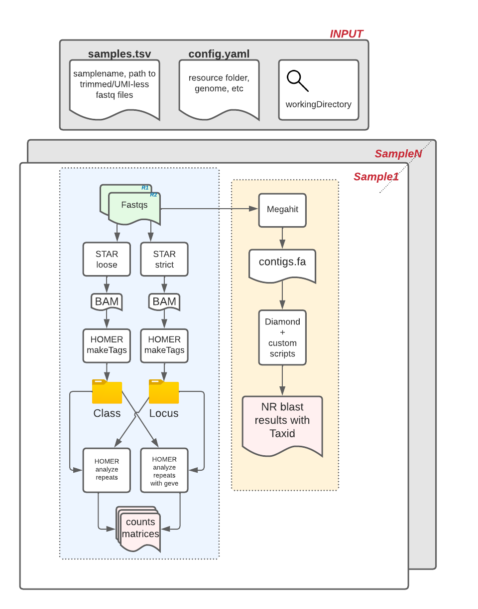

# ERV identification, annotation and quantification pipeline built for ccbr1271

### Table of Contents

- [Table of Contents](#table-of-contents)
  - [1. Disclaimers](#1-disclaimers)
  - [2. Background](#2-background)
  - [3. Flowchart](#3-flowchart)
  - [4. Technical Details](#4-technical-details)
    - [4.1 Usage](#41-usage)
    - [4.2 Resources](#42-resources)
    - [4.3 Location](#43-location)
  - [5. Version Notes](https://github.com/CCBR/RENEE/blob/main/CHANGELOG.md)

### 1. Disclaimers

> DISCLAIMERS:
>
> - Built specifically for [ccbr1271](https://abcs-amp.nih.gov/project/2487/view/) analysis
> - Tested only on [BIOWULF](https://hpc.nih.gov/)
> - Uses BIOWULF [modules](https://hpc.nih.gov/apps/modules.html)

<hr>
<p align="center">
	<a href="#erv-identification-annotation-and-quantification-pipeline-built-for-ccbr1271">Back to Top</a>
</p>
<hr>

### 2. Background

This pipeline detects and quantifies Endogenous Retroviruses using the scripts obtained from the Belkaid group.

<hr>
<p align="center">
	<a href="#erv-identification-annotation-and-quantification-pipeline-built-for-ccbr1271">Back to Top</a>
</p>
<hr>

### 3. Flowchart



<hr>
<p align="center">
	<a href="#erv-identification-annotation-and-quantification-pipeline-built-for-ccbr1271">Back to Top</a>
</p>
<hr>

### 4. Technical Details

#### 4.1 Usage

```bash
⠠⠵ ./erv

##########################################################################################

Welcome to

╭━━━╮╱╱╱╱╭╮╱╱╱╱╱╱╱╱╱╱╱╱╱╱╱╱╱╱╱╱╱╱╱╱╭━━━╮╱╱╭╮╱╱╱╱╱╱╱╱╱╱╱╱╱╱╱╱╱╱╭━━━╮╱╱╱╱╱╱╭╮
┃╭━━╯╱╱╱╱┃┃╱╱╱╱╱╱╱╱╱╱╱╱╱╱╱╱╱╱╱╱╱╱╱╱┃╭━╮┃╱╭╯╰╮╱╱╱╱╱╱╱╱╱╱╱╱╱╱╱╱╱┃╭━╮┃╱╱╱╱╱╱┃┃
┃╰━━┳━╮╭━╯┣━━┳━━┳━━┳━╮╭━━┳━━┳╮╭┳━━╮┃╰━╯┣━┻╮╭╋━┳━━┳╮╭┳┳━┳╮╭┳━━╮┃╰━╯┣┳━━┳━━┫┃╭┳━╮╭━━╮
┃╭━━┫╭╮┫╭╮┃╭╮┃╭╮┃┃━┫╭╮┫┃━┫╭╮┃┃┃┃━━┫┃╭╮╭┫┃━┫┃┃╭┫╭╮┃╰╯┣┫╭┫┃┃┃━━┫┃╭━━╋┫╭╮┃┃━┫┃┣┫╭╮┫┃━┫
┃╰━━┫┃┃┃╰╯┃╰╯┃╰╯┃┃━┫┃┃┃┃━┫╰╯┃╰╯┣━━┃┃┃┃╰┫┃━┫╰┫┃┃╰╯┣╮╭┫┃┃┃╰╯┣━━┃┃┃╱╱┃┃╰╯┃┃━┫╰┫┃┃┃┃┃━┫
╰━━━┻╯╰┻━━┻━━┻━╮┣━━┻╯╰┻━━┻━━┻━━┻━━╯╰╯╰━┻━━┻━┻╯╰━━╯╰╯╰┻╯╰━━┻━━╯╰╯╱╱╰┫╭━┻━━┻━┻┻╯╰┻━━╯
╱╱╱╱╱╱╱╱╱╱╱╱╱╭━╯┃╱╱╱╱╱╱╱╱╱╱╱╱╱╱╱╱╱╱╱╱╱╱╱╱╱╱╱╱╱╱╱╱╱╱╱╱╱╱╱╱╱╱╱╱╱╱╱╱╱╱┃┃
╱╱╱╱╱╱╱╱╱╱╱╱╱╰━━╯╱╱╱╱╱╱╱╱╱╱╱╱╱╱╱╱╱╱╱╱╱╱╱╱╱╱╱╱╱╱╱╱╱╱╱╱╱╱╱╱╱╱╱╱╱╱╱╱╱╱╰╯
... v1.0.0

##########################################################################################

This pipeline was built by CCBR (https://bioinformatics.ccr.cancer.gov/ccbr)
Please contact Vishal Koparde for comments/questions (vishal.koparde@nih.gov)

##########################################################################################

Here is a list of genome supported by this pipeline:

  * hg38          [Human]
  * mm10          [Mouse]

USAGE:
  /path/to/erv -w/--workdir=<WORKDIR> -m/--runmode=<RUNMODE>

Required Arguments:
1.  WORKDIR     : [Type: String]: Absolute or relative path to the output folder with write permissions.

2.  RUNMODE     : [Type: String] Valid options:
    * init      : initialize workdir
    * dryrun    : dry run snakemake to generate DAG
    * run       : run with slurm
    * runlocal  : run without submitting to sbatch
    ADVANCED RUNMODES (use with caution!!)
    * unlock    : unlock WORKDIR if locked by snakemake NEVER UNLOCK WORKDIR WHERE PIPELINE IS CURRENTLY RUNNING!
    * reconfig  : recreate config file in WORKDIR (debugging option) EDITS TO config.yaml WILL BE LOST!
    * recopy    : recreate tools.yaml, cluster.yaml and scriptsdir in WORKDIR (debugging option) EDITS TO these files WILL BE LOST!
    * reset     : DELETE workdir dir and re-init it (debugging option) EDITS TO ALL FILES IN WORKDIR WILL BE LOST!
    * local     : same as runlocal

Optional Arguments:

--genome|-g     : genome eg. hg38(default) or mm10
--manifest|-s   : absolute path to samples.tsv. This will be copied to output folder  (--runmode=init only)
--help|-h       : print this help

Example commands:
  ./erv -w=/my/output/folder -m=init [ -g="mm10" -s="/path/to/sample.tsv" ]
  ./erv -w=/my/output/folder -m=dryrun
  ./erv -w=/my/output/folder -m=run

##########################################################################################

VersionInfo:
  python          : 3.10
  snakemake       : 7.32.3
  pipeline_home   : /vf/users/EVset_RNAseq/Pipelines/ERVPipeline/dev
  git commit/tag  : d74ba8f364c0f20d5cf175bb2568783c2abd8c56
  pipeline_version: v1.0.0

##########################################################################################
```

<hr>
<p align="center">
	<a href="#erv-identification-annotation-and-quantification-pipeline-built-for-ccbr1271">Back to Top</a>
</p>
<hr>

#### 4.2 Resources

Please see [resources](!./docs/resources.md) page for details.

#### 4.3 Location

This pipeline is located at `/data/EVset_RNAseq/Pipelines/ERVPipeline` on [BIOWULF](https://hpc.nih.gov).

Refer complete [documentation](https://ccbr.github.io/ccbr1271_ERVpipeline/) for more details.

<hr>
<p align="center">
	<a href="#erv-identification-annotation-and-quantification-pipeline-built-for-ccbr1271">Back to Top</a>
</p>
<hr>

> Please reach out to [Vishal Koparde, Ph.D.](mailto:vishal.koparde@nih.gov) from [CCBR](https://bioinformatics.ccr.cancer.gov/ccbr) for comments/questions/requests/etc.
