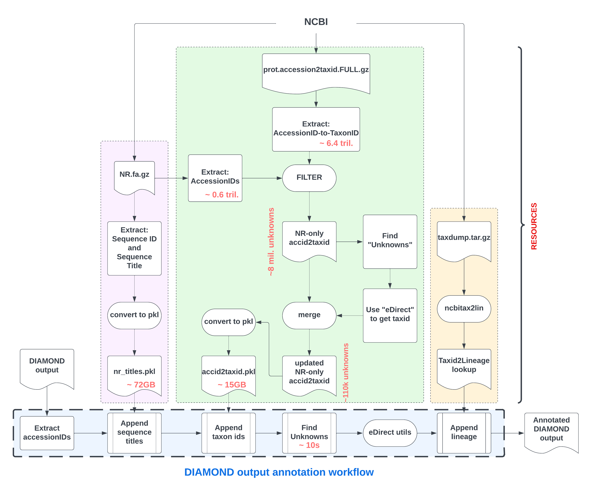

This pipeline requires a few resources to be created ahead of time to be supplied to the pipeline at runtime.

### Genomes

mm10 (mouse) and hg38 (human) genomes were downloaded from UCSC directly. Only canonical chromosomes were retained, that is, chr1 through chr19 plus chrX, chrY and chrM for mouse; and chr1 through chr22 plus chrX, chrY and chrM for human.

```bash
⠠⠵ wget https://hgdownload.soe.ucsc.edu/goldenPath/mm10/bigZips/mm10.fa.gz
⠠⠵ wget https://hgdownload.soe.ucsc.edu/goldenPath/hg38/bigZips/hg38.fa.gz
⠠⠵ gzip -d hg38.fa.gz
⠠⠵ mv hg38.fa hg38.full.fa
⠠⠵ module load seqtk && seqtk subseq hg38.full.fa chroms.lst > hg38.fa
⠠⠵ cat chroms.lst
chr1
chr2
chr3
chr4
chr5
chr6
chr7
chrX
chr8
chr9
chr11
chr10
chr12
chr13
chr14
chr15
chr16
chr17
chr18
chr20
chr19
chrY
chr22
chr21
chrM
```

### STAR index

STAR indices were built using version 2.7.9a and located at `/data/EVset_RNAseq/Pipelines/ERVPipeline/resources`.

### GEVE annotations

- GTF file is copied from `/data/EVset_RNAseq/chidesters2/ERV_code/Hsap38.geve.m_v2_SRK.gtf` and hardlinked as `hg38.geve.gtf`
- GTF file is copied from `/data/EVset_RNAseq/chidesters2/ERV_code/Mmus38.geve.m_v2_SRK.gtf` and hardlinked as `mm10.geve.gtf`
- `mm10.geve.annotation_table.tsv`

```bash
⠠⠵ wget //geve.med.u-tokai.ac.jp/download_data/table/Mmus38.txt.bz2
⠠⠵ bzip2 -d Mmus38.txt.bz2
⠠⠵ ln Mmus38.txt mm10.geve.annotation_table.tsv
```

- `hg38.geve.annotation_table.tsv`

```bash
⠠⠵ wget http://geve.med.u-tokai.ac.jp/download_data/table/Hsap38.txt.bz2
⠠⠵ bzip2 -d Hsap38.txt.bz2
⠠⠵ ln Hsap38.txt hg38.geve.annotation_table.tsv
```

### Creating taxid-to-lineage lookup

#### Download .dmp files

```bash
⠠⠵ wget ftp://ftp.ncbi.nih.gov/pub/taxonomy/new_taxdump/new_taxdump.tar.gz  .
⠠⠵ tar xzvf new_taxdump.tar.gz
```

The following `.dmp` files are extracted:

- citations.dmp
- delnodes.dmp
- division.dmp
- excludedfromtype.dmp
- fullnamelineage.dmp
- gencode.dmp
- host.dmp
- images.dmp
- merged.dmp
- names.dmp
- nodes.dmp
- rankedlineage.dmp
- taxidlineage.dmp
- typematerial.dmp
- typeoftype.dmp

We only need `names.dmp` and `nodes.dmp`

#### ncbitax2lin

[ncbitax2lin](https://github.com/zyxue/ncbitax2lin) converts the `names.dmp` and `nodes.dmp`
to a lineage csv file with columns:

- tax_id
- superkingdom
- phylum
- class
- order
- family
- genus
- species
- biotype
- clade
- clade1
- clade10
- clade11
- clade12
- clade13
- clade14
- clade15
- clade16
- clade17
- clade18
- clade19
- clade2
- clade3
- clade4
- clade5
- clade6
- clade7
- clade8
- clade9
- cohort
- forma
- forma specialis
- forma specialis1
- genotype
- infraclass
- infraorder
- isolate
- kingdom
- morph
- no rank
- no rank1
- no rank2
- no rank3
- no rank4
- no rank5
- parvorder
- pathogroup
- section
- series
- serogroup
- serotype
- species group
- species subgroup
- strain
- subclass
- subcohort
- subfamily
- subgenus
- subkingdom
- suborder
- subphylum
- subsection
- subspecies
- subtribe
- superclass
- superfamily
- superorder
- superphylum
- tribe
- varietas

ncbitax2lin is available in the "py311" conda env and requires very large amount of memory. H
ence, submitted like:

```bash
⠠⠵ sbatch slurm_job_high_memory ncbitaxid2lineage.sh
```

where

```bash
⠠⠵ more slurm_job_high_memory
#!/bin/csh -v
#SBATCH --job-name="taxid"
#SBATCH --mail-type=BEGIN,END
#SBATCH --mem=1500g
#SBATCH --partition="largemem"
#SBATCH --time=24:00:00


cd $SLURM_SUBMIT_DIR
sh $1
```

and

```bash
#!/bin/bash
. "/data/CCBR_Pipeliner/db/PipeDB/Conda/etc/profile.d/conda.sh"
conda activate py311
ncbitax2lin --nodes-file nodes.dmp --names-file names.dmp --output ncbi_lineages.csv.gz
```

### DIAMOND index

```bash
⠠⠵ module load diamond
⠠⠵ diamond makedb \
    --threads 56 \
    --in nr.gz \
    --db nr \
    --taxonmap prot.accession2taxid.FULL.gz \
    --taxonnodes nodes.dmp \
    --taxonnames names.dmp
```

- creates `nr.dmnd`
- it is about 300 GB in size

### Creating list of all protein accession ids in NR

#### Download entire nr

```bash
⠠⠵ wget https://ftp.ncbi.nlm.nih.gov/blast/db/FASTA/nr.gz
```

#### Extract all accession ids from the `nr.gz` file

```bash
⠠⠵ zcat nr.gz|grep "^>"|awk '{print $1}'|sed "s/>//g" > nr.accession_ids
```

This accounts to about 596 mil. accession ids. (~ 0.6 trillion)

> NOTE: some accession numbers have untrimmed prefixes or suffixes like:
> pir|E49255|
> prf||0803150A
> these should be
> E49255
> 0803150A

#### Split

```bash
⠠⠵ split -d -a 5 -l 1000000 nr.accession_ids nr.accession_ids.
```

This generates ~600 files.

### Get the accession_id-to-taxid lookup

#### Download it, and split it

```bash
⠠⠵ wget https://ftp.ncbi.nlm.nih.gov/pub/taxonomy/accession2taxid/prot.accession2taxid.FULL.gz
⠠⠵ pigz -d -p 4 prot.accession2taxid.FULL.gz
⠠⠵ split -d -a 5 -l 1000000 prot.accession2taxid.FULL prot.accession2taxid.
```

This creates 6356 files with 6355105289 total lines, i.e. ~ 6.4 trillion accession_id-to-taxid combinations.

> STATS:
>
> Total number of accession numbers in `nr.gz`: ~ 0.6 trillion
>
> Total number of protein accid to taxid rows in `prot.accession2taxid.FULL`: ~ 6.4 trillion

#### add taxid information from `prot.accession2taxid.FULL.gz` to the nr accid splits

```bash
⠠⠵ for i in {00000..00595};do echo bash ./   add_taxid.sh nr.accession_ids.splits/nr.accession_ids.
${i} nr.accession_ids.splits/nr.accession_ids.${i}.w_taxid;done > do_it

⠠⠵ swarm -f do_it -t 2 -g 120 --time=120:00:00
```

- The `add_taxid.sh` is run for each nr.accession_ids.split. It iterates through each of the
  6356 prot.accession2taxid splits and extracts the accid to taxid information. If taxid is not found the "Unknown" is reported.
- the `nr.accession_ids.?????.w_taxid` files contain a lot of "Unknown". (~ 13.5k per split)
  . Some "Unknown" can be re-queried with ncbi using **edirect** utils and taxid information can be distilled

#### update "Unknowns"

```bash
⠠⠵ for f in {00000..00595};do echo "bash ./post_process.sh $f > ${f}.log 2>&1";done > do_update

⠠⠵ swarm -f do_update -t 2 -m 120g --time=1:59:00 -m edirect --exclusive --maxrunning 1 --partition quick
```

- `post_process.sh`

  - extracts "Unknown"s from the `*.w_taxid` files
  - splits the "Unknown"s into chunks of 100 each
  - submit a query to NCBI using esummary with 100 accids at a time
  - gather all new taxid information
  - save `*.w_taxid.updated` file for each nr.accession_ids split

- "Unknown"s now average to about 178 per nr.accession_ids split. There are a total of 106138 "Unknowns" in the entire ~0.6 trillion nr.accession_ids. Most of these are due to deprecated accession ids or proteins no longer being part of any NCBI genome. These can be safely ignored.

#### create lookup table pickle

All the 596 updated files can be read into a single dict and saved as pickle for future 1-to-1 access. Memory needed to load the entire lookup table is around 130GB. The pkl file size is around 15GB.

```bash
⠠⠵ python topkl.py accid2taxid.pkl
```

- `accid2taxid.pkl` is 14GB in size
- loading the entire pkl in memory takes:
  - ~ 15 min
  - ~ 120 GB of RAM

### Create nr titles lookup pickle

#### extract sequence id and title

```bash
⠠⠵ zcat nr.gz|grep "^>"|sed "s/>//g" > nr.ids
```

#### build pickle

```bash
⠠⠵ python nr_topkl.py nr_titles.pkl
```

- `nr_titles.pkl` is ~ 72GB is size
- requires about 200 GB of RAM to load

### DIAMOND annotation workflow


